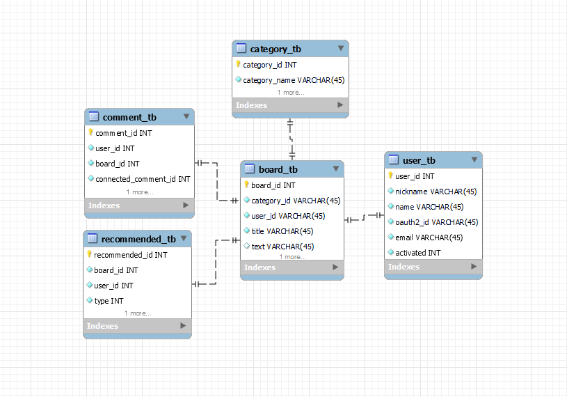

Board Toy Project
================

 

# 프로젝트 진행 순서
1. 기획
2. 상세 설계
3. 구현
4. 자체 QA
5. 수정

 

프로젝트 기획서
------------------------   

Link: [전체 기획서][notionlink]

[notionlink]: https://whispering-school-6df.notion.site/Toy-Project-21c2a3af825d42ba80fed608be92561f?pvs=74 "Notion"

 

상세 설계
-----------------------------

ERD 설계

 

API 명세서

Link: [API 명세서][notionlink2]

[notionlink2]: https://whispering-school-6df.notion.site/API-7982a9cae4314fb4995aed115c80bc80?pvs=4 "Notion"
